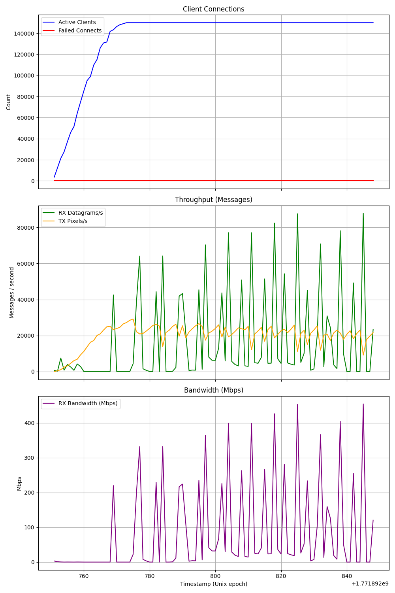

# Bare Metal Canvas

*Result: Handled 150k concurrent clients/connections with just 5 worker threads... and the 10-year-old CPU wasn't even sweating.*

System design might be fake. I just wanted to see the absolute limits of a 10-year-old Ryzen 3600X chip using `io_uring` to tackle the Reddit r/place challenge.

### What we are doing
Building an ultra-high-throughput, low-overhead UDP/QUIC server to handle tens of thousands of concurrent client connections and pixel updates on a shared 1000x1000 canvas.

### Optimizations Done
- **`io_uring` & Massive UDP Opti**: Maximized throughput using `RecvMsgMulti`/`SendMsg` batching in `io_uring`. Combined with `32MB` kernel buffers, `SO_REUSEPORT` for lockless thread load balancing, and `ProvideBuffers` for zero-copy buffer replenishment to entirely eliminate syscall overheads userspace <-> kernel.
- **Lock-Free Master/Worker Architecture**: Designed a master tick process to handle global active canvas bounds, preventing heavy lock contention in worker hot loops. Workers only handle pixel updates and broadcasting. Master communicates with workers via SPSC lockfree channel.
- **Delta State Broadcasting**: Implemented a system where workers maintain local canvas copies and broadcast only the diffs of changed cells to clients, significantly reducing CPU spikes and connection drops.
- **Fast RLE Compression**: Developed sub-millisecond Run-Length Encoding leveraging SIMD to compress full canvas snapshots prior to transmission.
- **Zero-Allocation Datagram Unpacking**: Refactored QUIC payload operations to build `PixelDatagram` records directly from raw receive buffers.
- **SIMD Timing Wheel for Cooldowns**: Built a custom tick-based timing wheel backed by raw Bitmaps for pixel cooldowns. Evictions happen via massive `O(1)` bitwise `AND NOT` operations instead of tracking individualized user timeouts or iterating HashMaps.
